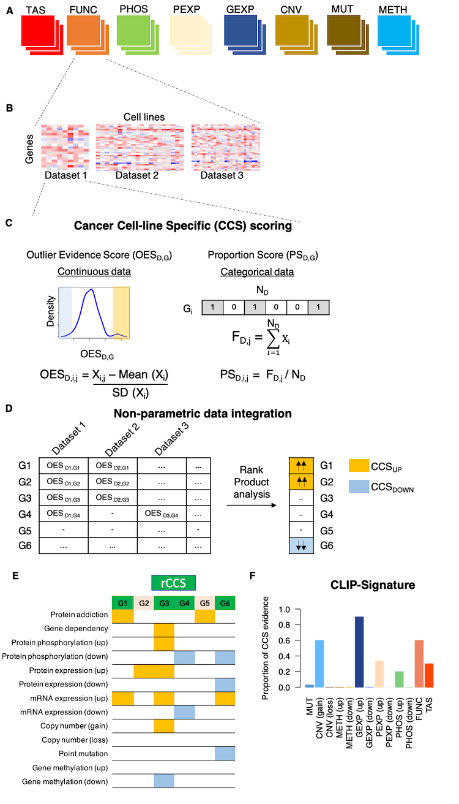

# Cell Line specific gene Identification Pipeline (CLIP)

## CLIP Rationale
CLIP enables systematic meta-analysis and integration of multi-modal omics datasets collected for multiple research laboratories. CLIP is a “bottom-up” approach  to meta-analysis and data integration. To boost the statistical power toward finding robust and reproducible signals, the CLIP framework accounts for the substantial variability in the consistency of the various types of modalities between laboratories. 

First, we define the notion of a “Cancer Cell line Specific” (CCS) gene; as a gene that exhibits a molecular attribute unique to a particular cancer cell line. In other words, a CCS gene is unique to a given cell line in reference to all the other cell lines in the particular dataset, i.e. having a context-specific property, and therefore possibly related to a specific cancer subtype or cellular function. Statistically, a gene that has the tendency to be located towards the extremes of the distribution in any given dataset is considered as a CCS gene. For instance, the expression of ERBB2 gene is much higher in HER2 driven breast cancer cell lines, compared to cell lines from other tissue types. Thus, in all HER2+ cell lines, ERBB2 is a CCS gene in the gene expression modality. 

<p align="center"> 
​
</p>

## CLIP Flowchart

<p align="center"> 
​
</p>

## CLIP pipeline execution

### Step 1

```r
# Code for CLIP exection
source("clip-meta/R/clip/clip.R")

###########################################################################
### Step 1a: Quantile Normalization and Scaling of continuous datasets  ###
### Outlier Evidence Score (OES) scores                                 ###
###########################################################################
# The first step involves loading all processed data sets and Quantile normalization and Outlier Evidence Score (OES) estimates

source("clip-meta/R/clip/clip_functions.R")
# source functions utilized in CLIP pipeline 

#Read table of human genes and subset to coding genes
homo.genes <- read.table("clip-meta/data/Human_coding_genes.tsv", sep="\t", header=F, stringsAsFactors = F, quote="", fill=T)
homo.genes.coding.table <- homo.genes[homo.genes$V10 == "protein-coding", ]
homo.genes.coding.table$ENSEMBLID <- gsub("Ensembl:", "", sapply(strsplit(homo.genes.coding.table$V6, "\\|"), "[", 3))
homo.genes.coding <- homo.genes.coding.table$V3

#load processed datasets for each modality 

#Download all h5 format processed datasets from: https://doi.org/10.6084/m9.figshare.13473168
#Save datasets in clip-meta/data folder

#Methylation profiles
source("clip-meta/R/reproducibility_analysis/reproducibility_analysis_functions.R")
path = "clip-meta/data/"
modality = "METH"
METH.list <- loadData(path, modality)
for (i in 1:length(METH.list)){
  dname <- names(METH.list)[i]
  dname <- tolower(paste(modality, dname, sep="."))
  mat = METH.list[[i]]
  assign(dname, as.data.frame(mat, stringsAsFactors = F))
  rm(mat)
}
rm(METH.list)

#Quantile normalization
METH.QUANT.LIST <- list(meth.nci60, meth.ohsu, meth.sanger, meth.broad)
names(METH.QUANT.LIST) <- c("METH.NCI60", "METH.OHSU", "METH.SANGER", "METH.BROAD")
METH.QUANT.LIST <- lapply(METH.QUANT.LIST, function(x){
  y <- x[rownames(x) %in% homo.genes.coding,]
  return(y)
} ) #subset to coding genes
METH.QUANT.LIST <- lapply(METH.QUANT.LIST,QuantNormScale) # Quantile normalization
lapply(METH.QUANT.LIST, function(x) x[1:5, 1:5])

#Replace METH with GEXP, PEXP, PHOS, FUNC, TAS or DSS modality names 


######################################################################
### Step 1b: Proportion scores in binary datasets                  ###
######################################################################
# For binary datasets estimate proportion scores


# load Copy number variation data
path = "clip-meta/data/"
modality = "CNV"
CNV.list <- loadData(path, modality)
for (i in 1:length(CNV.list)){
  dname <- names(CNV.list)[i]
  dname <- tolower(paste(modality, dname, sep="."))
  mat = CNV.list[[i]]
  assign(dname, as.data.frame(mat, stringsAsFactors = F))
  rm(mat)
}
rm(CNV.list)

# Binarize copy number profiles 
broad.cnv.bin <- BinarizeCNV(cnv.broad, threshDEL = 1, threshAMP = 1)
sanger.cnv.bin <- BinarizeCNV(cnv.sanger, threshDEL = 0.5, threshAMP = 0.5)
gcsi.cnv.bin <- BinarizeCNV(cnv.gcsi, threshDEL = 0.5, threshAMP = 0.5)
nci60.cnv.bin <- BinarizeCNV(cnv.nci60, threshDEL = 0.4, threshAMP = 0.4)
uhn.cnv.bin <- BinarizeCNV(cnv.uhn, threshDEL = 0.4, threshAMP = 0.4)
ohsu.cnv.bin <- BinarizeCNV(cnv.ohsu, threshDEL = 0.5, threshAMP = 0.5)

# Estimate proportion scores
broad.cnv.prop <- lapply(broad.cnv.bin, CalculatePropScores)
sanger.cnv.prop <- lapply(sanger.cnv.bin, CalculatePropScores)
gcsi.cnv.prop <- lapply(gcsi.cnv.bin, CalculatePropScores)
nci60.cnv.prop <- lapply(nci60.cnv.bin, CalculatePropScores)
uhn.cnv.prop <- lapply(uhn.cnv.bin, CalculatePropScores)
ohsu.cnv.prop <- lapply(ohsu.cnv.bin, CalculatePropScores)

#Subset to set of coding genes
CNV.DEL.LIST <- list(uhn.cnv.prop$DEL, broad.cnv.prop$DEL, nci60.cnv.prop$DEL, ohsu.cnv.prop$DEL, gcsi.cnv.prop$DEL, sanger.cnv.prop$DEL)
CNV.DEL.LIST <- lapply(CNV.DEL.LIST, function(x){
  y <- x[rownames(x) %in% homo.genes.coding,]
  return(y)
} )
names(CNV.DEL.LIST) <- c("CNV_DEL.UHN", "CNV_DEL.BROAD", "CNV_DEL.NCI60", "CNV_DEL.OHSU", "CNV_DEL.gCSI", "CNV_DEL.SANGER")
lapply(CNV.DEL.LIST, function(x) x[1:5, 1:5])

CNV.AMP.LIST <- list(uhn.cnv.prop$AMP, broad.cnv.prop$AMP, nci60.cnv.prop$AMP, ohsu.cnv.prop$AMP, gcsi.cnv.prop$AMP, sanger.cnv.prop$AMP)
CNV.AMP.LIST <- lapply(CNV.AMP.LIST, function(x){
  y <- x[rownames(x) %in% homo.genes.coding,]
  return(y)
} )
names(CNV.AMP.LIST) <- c("CNV_AMP.UHN", "CNV_AMP.BROAD", "CNV_AMP.NCI60", "CNV_AMP.OHSU", "CNV_AMP.gCSI", "CNV_AMP.SANGER")
lapply(CNV.AMP.LIST, function(x) x[1:5, 1:5])

#Replace CNV.DEL/CNV.AMP with MUT for mutational profiles

# Save all processed files 
save(file="clip-meta/processed_files/clip/Normalized_Modalities.RData",compress="bzip2",
     FUNC.QUANT.LIST, METH.QUANT.LIST, GEXP.QUANT.LIST, PEXP.QUANT.LIST, 
     PHOS.QUANT.LIST, TAS.QUANT.LIST, CNV.DEL.LIST, CNV.AMP.LIST, MUT.LIST)

``` 

### Step 2
```r
######################################################################
### Step 2: CLIP - meta analysis of breast cancer cell lines       ###
######################################################################
# Meta-analysis and integration of OES scores from multiple studies for each breast cancer cell lines

#load normalized and scaled data in Step 1
load("clip-meta/processed_files/clip/Normalized_Modalities.RData")

#read Meta data on Breast cancer cell lines
brca.data.view <- readxl::read_xlsx("clip-meta/data/BRCA_Cellline_metadata.xlsx", sheet =1)
breast.cells <- brca.data.view$CellName

#Meta-analysis and selection of CCS genes for each modality
brca.mut.meta     <- IntegrateCCS(MUT.LIST, 
                                  Modality= "MUT",     
                                  cellNames= breast.cells, 
                                  SingleSelectThreshold= 10, 
                                  SelectIndx=4, 
                                  SelectThreshold=0.1)
brca.cnv_del.meta <- IntegrateCCS(CNV.DEL.LIST, 
                                  Modality= "CNV_DEL", 
                                  cellNames= breast.cells,
                                  SingleSelectThreshold= 10,
                                  SelectIndx=4, 
                                  SelectThreshold=0.1)

brca.cnv_amp.meta <- IntegrateCCS(CNV.AMP.LIST, 
                                  Modality= "CNV_AMP", 
                                  cellNames= breast.cells, 
                                  SingleSelectThreshold= 10, 
                                  SelectIndx=4, 
                                  SelectThreshold=0.1)


# Meta-analysis and selection of CCS genes in  each modality
# Rank-product integration of CCS scores 


brca.meth.meta <- IntegrateCCS(METH.QUANT.LIST, 
                               Modality= "METH", 
                               cellNames= breast.cells, 
                               SingleSelectThreshold= 100, 
                               SelectIndx=4, 
                               SelectThreshold=0.1)
                               
#SelectThreshold = pfp threshold for selection of CCS genes after Rank integration
#SingleSelectThreshold = threshold for selection of top N CCS genes for cell lines profiled in only 1 study
  
brca.gexp.meta <- IntegrateCCS(GEXP.QUANT.LIST,
                               Modality= "GEXP", 
                               cellNames= breast.cells, 
                               SingleSelectThreshold= 100, 
                               SelectIndx=4, 
                               SelectThreshold=0.1)

brca.pexp.meta <- IntegrateCCS(PEXP.QUANT.LIST,
                               Modality= "PEXP", 
                               cellNames= breast.cells, 
                               SingleSelectThreshold= 100, 
                               SelectIndx=4, 
                               SelectThreshold=0.1)

brca.phos.meta <- IntegrateCCS(PHOS.QUANT.LIST,
                               Modality= "PHOS", 
                               cellNames= breast.cells, 
                               SingleSelectThreshold= 10, 
                               SelectIndx=4, 
                               SelectThreshold=0.1)

brca.func.meta <- IntegrateCCS(FUNC.QUANT.LIST,  
                               Modality = "FUNC", 
                               cellNames= breast.cells, 
                               SingleSelectThreshold= 200, 
                               SelectIndx=4, 
                               SelectThreshold=0.25)

brca.tas.meta <- IntegrateCCS(TAS.QUANT.LIST,
                               Modality= "TAS", 
                               cellNames= breast.cells, 
                               SingleSelectThreshold= 10, 
                               SelectIndx=4, 
                               SelectThreshold=0.1)


# Save all processed files for next step
save(file = "clip-meta/processed_files/clip//CLIP_Integrated_Breast.RData",
     brca.mut.meta, brca.cnv_del.meta, brca.cnv_amp.meta, brca.meth.meta, brca.gexp.meta,
     brca.pexp.meta, brca.phos.meta, brca.func.meta, brca.tas.meta, compress="bzip2")


``` 

### Step 3
```r
#########################################################################
### Step 3: CLIP - Rank Product Integration                          ####
### Identification of rCCS genes                                     ####
#########################################################################
# Integration of Cell line Specific genes (CCS) genes from multiple modalites to identify robust CCS (rCCS) for each breast cancer cell lines

#load data from Step 2
load("clip-meta/processed_files/clip//CLIP_Integrated_Breast.RData")

# Retriever CCS genes for each cell line
brca.rCCS.list <- list(FUNC    = brca.func.meta,
                       TAS     = brca.tas.meta,
                       METH    = brca.meth.meta, 
                       GEXP    = brca.gexp.meta,
                       PEXP    = brca.pexp.meta,
                       PHOS    = brca.phos.meta, 
                       CNV_DEL = brca.cnv_del.meta,
                       CNV_AMP = brca.cnv_amp.meta, 
                       MUT     = brca.mut.meta)
                       
brca.rCCS.genes.list <- list()
for ( c in breast.cells){
  cellName = c
  brca.rCCS.genes.list[[cellName]] <- list()

  for ( i in 1:length(brca.rCCS.list)){
    modality <- names(brca.rCCS.list)[i]
    brca.rCCS.genes.list[[cellName]][[modality]] <- list()
    
    #Table 1 = CCS_DOWN genes (for FUNC, CCS_UP)
    modality1 = paste(modality, "_T1", sep="")
    geneNames_1 = brca.rCCS.list[[i]]$cellIntResults[[c]]$Table1.genes
    if(length(geneNames_1)==0) geneNames_T1 <- cbind(modality=NA, GeneID=NA)
    if(length(geneNames_1)>0) geneNames_T1 <- cbind(modality=modality1, GeneID=geneNames_1)
    
    #Table 2 = CCS_UP genes (for FUNC, CCS_DOWN)
    modality2 = paste(modality, "_T2", sep="")
    geneNames_2 = brca.rCCS.list[[i]]$cellIntResults[[c]]$Table2.genes
    if(length(geneNames_2)==0) geneNames_T2 <- cbind(modality=NA, GeneID=NA)
    if(length(geneNames_2)>0) geneNames_T2 <- cbind(modality=modality2, GeneID=geneNames_2)
    
    geneNames_T1_T2 <- rbind(geneNames_T1, geneNames_T2)
    geneNames_T1_T2 <- as.data.frame(geneNames_T1_T2, stringsAsFactors = F)
    geneNames_T1_T2 <- geneNames_T1_T2[complete.cases(geneNames_T1_T2), ]
    
    brca.rCCS.genes.list[[cellName]][[modality]] <- geneNames_T1_T2
  }
}

# Add CCS_UP or CCS_DOWN direction
all.modes <- c("FUNC_UP", "TAS_UP", "TAS_DOWN", "METH_UP", "METH_DOWN", 
               "GEXP_UP", "GEXP_DOWN", "PEXP_UP", "PEXP_DOWN",
               "PHOS_UP", "PHOS_DOWN", "CNV_DEL", "CNV_AMP", "MUT")
brca.rCCSmat.list <- lapply(brca.rCCS.genes.list,RearrangeCCS)
brca.rCCSmat <- ProcessCCSlist(brca.rCCSmat.list, keepMode = NA)
save(file="clip-meta/processed_files/clip/CLIP_rCCS_Breast.RData", brca.rCCSmat.list, brca.rCCSmat, compress="bzip2")

``` 

### Benchmarking CLIP 

```r
#Source the following R file to run CLIP benchmarking
source("clip-meta/R/clip/clip_benchmark.R")
..
``` 

### Reproduciblity analyses

```r
#Source the following R files to run correlation analyses between datasets
source("clip-meta/R/reproducibility_analysis/reproducibility_analysis_functions.R")
source("clip-meta/R/reproducibility_analysis/reproducibility_analysis.R")
..
``` 

## Citation

    @article{Jaiswal2020,
        author = {Jaiswal, A. and Gautam, P. and Pietilä, A. and Timmonen, S. and Zenz, T. and Nordström, N. and Akimov, Y. and Sipari, N. and Tanoli, Z. and Lehti, K. and Wennerberg, K. and Aittokallio, T.},
        title = {Multi-modal meta-analysis of cancer cell line omics profiles identifies ECHDC1 as a novel breast tumor suppressor},
        year = {2020},
        doi = {10.1101/2020.01.31.929372},
        publisher = {Cold Spring Harbor Laboratory},
        URL = {https://www.biorxiv.org/content/10.1101/2020.01.31.929372v1.abstract},
        journal = {bioRxiv}
    }


# clip-meta
# clip-meta
